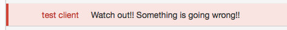

# hipnotify

[](https://pypi.python.org/pypi/hipnotify)
[](https://pypi.python.org/pypi/hipnotify)
[](https://travis-ci.org/achiku/hipnotify)
[](https://gemnasium.com/achiku/hipnotify)


Deadly simple HipChat API V2 room notification library


# Why created

I wanted HipChat V2 API + Python3 compatible HipChat client which can only send messages to the specified room.


# Usage

```python
# -*- coding: utf-8 -*-
from hipnotify import Room

HIPCHAT_TOKEN = 'token'
HIPCHAT_ROOM_ID = 'room_id'


if __name__ == '__main__':
    room = Room(HIPCHAT_TOKEN, HIPCHAT_ROOM_ID)
    room.notify('hello, world!')
```


```python
room.notify('Watch out!! Something is going wrong!!', color='red')
```




```python
room.notify('Ha? Just <a href="https://google.com">google</a> it.', message_format='html')
```


